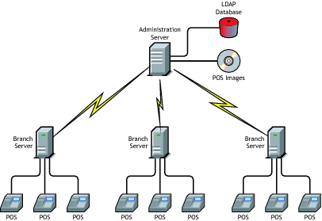

class: center, middle

# SLEPOS: Introducción y troubleshooting

---

# Agenda

1. Introducción
2. Arquitectura
3. Diseño de configuración en LDAP
4. Configuración inicial: `posInitAdminserver`
5. Configuración de Branch server y herramienta `posAdmin`
6. Inicialización de Branch: `posInitBranchserver`
7. Pantallazo de servicios que se ejecutan en un servidor Branch
8. Comandos en un servidor Branch
9. Creación de imágenes
10. Registro y sincronización de imagenes
11. Boot de imágenes
12. Troubleshooting
13. Soporte
14. Demos
15. Futuro: SUSE Manager for Retail 3.2.x

---

# Introducción

SUSE Linux Point of Server 11 SP3 (SLEPOS 11 SP3) es una plataforma de software especializada para organizaciones de retail. Permite distribuir imagenes de sistemas operativos a cajas registradoras o máquinas de auto-servicio de una manera sencilla.

Es un _add-on_ que se agrega a SLES11 SP4 y SLES11 SP3.

---

# Arquitectura de SLEPOS 11

<!-- .center[] -->


---

# Diseño de configuración en LDAP

El árbol LDAP se compone de la siguiente manera. Por ejemplo:

```bash
c=PE (country)
+ o=HPSA (organization)
.    + cn=global (scRefObjectContainer)
.    .    + cn=CR_RP40_3000 (scCashRegister)
.    .    .    + cn=config.xml (scConfigFileSyncTemplate)
.    .    .    + cn=sda (scHarddisk)
.    .    .    .    + scPartNum=0 (scPartition)
.    .    .    .    + scPartNum=1 (scPartition)
.    .    .    .    + scPartNum=2 (scPartition)
.    .    + cn=default (scDistributionContainer)
.    .    .    + cn=minimal (scPosImage)
.    .    .    + cn=ncr3000 (scPosImage)
.    .    .    .    + scVersion=1.0.0 (scImageVersion)
.    + cn=standards (scHardware)
.    + ou=PROMART (organizationalUnit)
.    .    + cn=HPLMPRCRV0523 (scLocation)
.    .    .    + cn=posdefaults (scPxeFileTemplate)
.    .    .    + cn=server (scServerContainer)
.    .    .    .    + cn=HPLMPRCRVPOS010523 (scBranchServer)
.    .    .    .    .    + cn=dhcp (scService)
.    .    .    .    .    + cn=dns (scService)
.    .    .    .    .    + cn=posaswatch (scService)
.    .    .    .    .    + cn=posleases (scService)
.    .    .    .    .    + cn=tftp (scService)
.    .    .    .    .    + scDevice=eth0 (scNetworkcard)
```

---

# Configuración inicial

Gran parte de la estructura del árbol LDAP se configura con `posInitAdminserver`. Ejemplo:

```bash
# posInitAdminserver
------------------------------------------------------------------------------
                   AdminServer LDAP Configuration
------------------------------------------------------------------------------
Please enter your organization/company name []: HPSA
Please enter the 2 letter abbreviation of your country []: PE
Please choose the LDAP administrator password:
Please enter the password again:
Enable secure connection (SSL) to LDAP service? (yes/no) [yes] yes
Please enter LDAP configuration database password, keep empty to recreate LDAP database from scratch:
Recreate LDAP database? All data in LDAP database will be destroyed! (yes/no)
```

---

# Configuración de Branch server y comando `posAdmin`

* Toda la configuración de los servidores Branch se encuentra en la base de datos LDAP del servidor de Administración central.

* Esta configuración se crea con el comando `posAdmin`, sin embargo, el procedimiento no es interactivo como con el comando `posInitAdminserver`.

* Un ejemplo uno de los varios comandos que hay que ejecutar para dar de alta la configuración de un servidor Branch, es el siguiente:

```bash
# posAdmin \
  --base ou=PROMART,o=HPSA,c=PE --add --scLocation --cn HPLMPRCRV0523 \
  --ipNetworkNumber 192.168.1.0 --ipNetmaskNumber 255.255.255.0 \
  --scDhcpRange 192.168.1.10,192.168.1.20 \
  --scDhcpFixedRange 192.168.1.30,192.168.1.40 \
  --scDefaultGw 192.168.1.1 \
  --scDynamicIp TRUE --scDhcpExtern FALSE \
  --scWorkstationBaseName REG --scEnumerationMask 000 \
--userPassword mypassword
```

---

# Configuración de Branch server (cont.)

Para evitar errores y realizar el alta de servidores branch o tiendas de manera más eficiente, he creado un script interactivo que se almacena en GitHub y hace uso del comando `posAdmin`:

* [slepos_setup_branch.sh](https://github.com/gpoppino/suse-toolbox/blob/master/slepos_setup_branch.sh)

Un fragmento del mismo es el siguiente:

```bash
...
echo "[ SLEPOS STORE SETUP ${VERSION} ]"
echo
echo "Please, enter the following store information:"
read -e -p "Organizational Unit (example: myOU): " OU
read -e -p "Store number: " STORE
read -e -p "Network: " NETWORK
read -e -p "Network mask: " MASK
read -e -p "Start of dynamic range of IP addresses: " DYNAMIC_IP_RANGE_START
read -e -p "End of dynamic range of IP addresses: " DYNAMIC_IP_RANGE_END
read -e -p "Start of fixed range of IP addresses: " FIXED_IP_RANGE_START
read -e -p "End of fixed range of IP addresses: " FIXED_IP_RANGE_END
read -e -p "Gateway: " GATEWAY
read -e -p "Server IP address: " SERVER_IP
...
```

---

# Inicialización de servidor Branch

Una vez configurada una tienda en el servidor LDAP, se deben configurar e iniciar los servicios en el servidor Branch con el comando `posInitBranchServer`.

Esto comprende crear o actualizar archivos de configuración de texto de cada servicio según su configuración almacenada en LDAP, e iniciar dicho servicio. Por ejemplo, para el servicio DHCP se genera el archivo `/etc/dhcpd.conf`.

Hay dos métodos de inicialización de un Branch: online y offline.

---

# Inicialización de servidor Branch (cont.)

Ejemplo:

```bash
# posInitBranchServer
------------------------------------------------------------------------------
     BranchServer Configuration
------------------------------------------------------------------------------
[INFO] loading defaults from previous configuration
Branch Server reinitialization...
Available initialization modes:
        1 = Online(default)
        2 = Offline
Please, select initialization mode: 1
Please enter your organization/company name []: HPSA
Please enter the 2 letter abbreviation of your country []: PE
Please enter the name of organizational unit []: PROMART
Please enter the location/branch name []: HPLMPRCRV0523
Please enter the name or IP of the AdminServer []: admin.suse.ar
Please enter the Branch Server access password:
Trying to synchronize server certificates
        with admin server...

Initializing Branch LDAP server...
Use Branch LDAP on localhost? (yes/no) [yes]
...
```

---

# Servicios en un servidor de tienda (Branch)

Los servicios que brinda el servidor Branch de SLEPOS 11 son los siguientes:

* **DHCP**: asigna direcciones de IP a las cajas registradoras y permite realizar boot a través de la red (PXE).
* **TFTP**: permite bajar archivos como el kernel/initrd e imagen al punto de venta (POS).
* **DNS**: brinda servicio de resolución de nombres.
* **posleases2ldap**: servicio que permite el registro de la caja registradora en LDAP y la creación de la configuración necesaria para realizar boot de la misma.
* **posaswatch**: verifica si el servidor de administración está disponible.

---

# Comandos en un servidor Branch

En un servidor Branch, se pueden realizar operaciones sobre los objetos LDAP de las cajas con el comando `pos`. Por ejemplo:

* Mostrar las cajas disponibles:

```bash
# pos ws-list
CN       MAC               IP              HWTYPE          ID         Role                            │
REG001   52:54:00:42:3C:48 192.168.1.20    QEMUStandard PC (i440FX + PIIX, 1996) <No ID>    <No role>
```

* Eliminar un objeto de caja registradora y su configuración en el Branch:

```bash
# pos ws-remove REG001; pos dump-all
```

* Mostrar las imágenes disponibles:

```bash
# pos image-list
IMAGE
   VERSION    FILE                      STATUS
ncr3000
   1.0.0      ncr3000.i686-1.0.0        OK
minimal
   3.4.0      minimal.i686-3.4.0        Invalid image file path
   ```

---

# Creación de objetos de caja registradoras

Se utiliza el comando `posAdmin` para crear los objetos de las cajas registradoras.

Estos objetos identifican el hardware y asignan la imagen a instalar. También asocian archivos de configuración, como por ejemplo `xorg.conf` para un modelo de caja registradora específico. Finalmente, indican como será el particionamiento del disco.

Para realizar esto de manera más rápida y eficiente, he creado el script interactivo [slepos_add_cash_register.sh](https://github.com/gpoppino/suse-toolbox/blob/master/slepos_add_cash_register.sh) disponible en GitHub.

---

# Creación de imágenes

Las imágenes para los puntos de venta se crean con una herramienta llamada [**`KIWI`**](https://opensource.suse.com/kiwi/index.html).

`KIWI` es una herramienta de línea de comandos, pero también tiene una [interfaz de YaST](https://www.suse.com/documentation/slepos11/singlehtml/book_slepos/book_slepos.html#cha.slepos_imgcreator).

`KIWI` crea una imagen basándose en un archivo de configuración en formato XML. Generalmente, estas configuraciones se encuentra en `/var/lib/SLEPOS/system/[nombre_de_imagen]/config.xml`.

El archivo [`config.xml`](https://www.suse.com/documentation/slepos11/singlehtml/book_slepos/book_slepos.html#ex.kiwi.configxml_sle11) contiene el listado de paquetes, listado de usuarios, archivos _tar.gz_, etc. que serán incluidos en la imagen.

Los paquetes RPM se obtienen generalmente desde un servidor [SMT (Subscription Management Tool)](https://www.suse.com/documentation/smt11/index.html) instalado localmente en el servidor de imágenes.

El resultado de [ejecutar `kiwi`](https://www.suse.com/documentation/slepos11/singlehtml/book_slepos/book_slepos.html#cha.slepos_kiwi_sle11) es un kernel y un initrd, para realizar el boot por PXE de la imagen, y también el archivo de la imagen que será instalado en el punto de venta.

---

# Registro de una imagen en el servidor de Administración

Para _registrar_ una imagen (copiar y crear el objeto LDAP) con el servidor de Administración, se debe ejecutar el comando `registerImages`. Por ejemplo:

```bash
# registerImages --ldap --kernel \
    /var/lib/SLEPOS/system/images/ncr3000-1.0.0/initrd*.kernel --initrd \
    /var/lib/SLEPOS/system/images/ncr3000-1.0.0/initrd-netboot-suse-SLES11.i686-2.1.1.splash.gz \
    /var/lib/SLEPOS/system/images/ncr3000-1.0.0/ncr3000.i686-1.0.0.gz
```

---

# Sincronizar imagen desde Admin a Branch

Una vez registrada la imagen con el servidor de Administración, esta se debe copiar a cada servidor Branch que desee hacer uso de la misma.

Esto se realiza con el comando:

```bash
   # possyncimages
```

Se utiliza `rsync` para efectuar la copia.

---

# Boot de un punto de venta

Pasos del boot de una caja registradora por primera vez:

1. El kernel hace boot y carga el initrd, como cualquier otro Linux, pero el boot inicial se hace a través de PXE.
2. La caja (script) sube un archivo con su información al Branch (hwtype.config).
3. El branch crea el objeto en LDAP y la configuración de la caja en `/srv/tftpboot/CR` llamado `config.MAC`. Donde MAC es la MAC address de la caja.
4. La caja continua el boot y baja la imagen y archivos de configuración basándose en el archivo `config.MAC`.
5. Se instala la imagen.
6. Se activa el kernel de la imagen instalada y continua el boot hasta finalizar.

Pasos de boot de una caja registradora luego de una instalación de imagen:

1. Si se detecta que hay una imagen ya instalada en disco (contiene los archivos `/etc/Image*`) y no hay una versión superior en el Branch, el boot continua sin instalar la imagen.

---

# Troubleshooting

A continuación se describen algunos problemas y sus posibles soluciones:

* Problema: el punto de venta no se registra con el servidor de Administración.
 * Verificar que el servicio `posleases2ldap` se encuentre corriendo en el Branch con `rcposleases2ldap status`.
 * Verificar que el servicio `openldap` se encuentre en ejecución con `rcldap status` en el Admin y Branch.

* Problema: la imagen no puede ser sincronizada al Branch.
 * Ejecutar `possyncimages -v 9`, incrementado así el detalle del output del comando.

* Problema: el ingeniero de backline solicita logs específicos de SLEPOS.
 * Ejecutar `save_poslogs slepos_logs.tgz` en el Branch y Admin. Enviar el archivo `slepos_logs.tgz` resultante.

---

# Troubleshooting (cont.)

* Problema: la imagen no puede ser instalada por algún motivo.
 * Verificar el status de la misma con `pos image-list` en el servidor Branch.
 * Verificar que el tamaño de disco del punto de venta sea igual o mayor al particionamiento indicado en el objeto de la caja registradora (scCashRegister -> scPartition) en LDAP.
 * Verificar que el ID de hardware del punto de venta se corresponda con los IDs ya creados en el objeto `scCashRegister` en LDAP.

---

# Soporte

Para que la solución de SLEPOS tenga soporte, se debe contar con lo siguiente:

1. Servidores Admin, Branch(es) e Image en SLES11 SP4 + SLEPOS11 SP3: soporte general hasta 31 de Marzo del 2019 y con LTSS hasta el 31 de Marzo del 2022.
2. Puntos de venta con SLES11 SP3 + SLEPOS11 SP3: soporte hasta 31 de Marzo del 2022.

---

class: center, middle

# Grandes demos aguardan. Esperemos que funcionen!

---

# Futuro (Presente?): SUSE Manager for Retail 3.2.x

A grandes rasgos, estas son las características de [SUSE Manager for Retail 3.2](https://www.suse.com/documentation/suse-manager-for-retail-3-2/):

* Basado en SUSE Manager 3.2.x y SLES12 SP3 (solo 64bits).
* Ya no se almacena la configuración en LDAP.
* El servidor Branch es un servidor Proxy de SUSE Manager.
* Las configuraciones de Branch se aplican con _States de Salt_.
* Se sigue utilizando _KIWI_ para la creación de imágenes.
* Todos los servidores Branch y Cajas quedan registrados con SUSE Manager.
* Las imágenes de los puntos de venta pueden ser inspeccionadas por patches y vulnerabilidades.
* La configuración de la solución se realiza desde archivos [YAML](https://www.suse.com/documentation/suse-manager-for-retail-3-2/retail-getting-started/retail.chap.admin.html#_example_yaml_file_for_mass_configuration) o formularios de SUSE Manager.

---

class: center, middle

# Preguntas

## (fin)

https://gpoppino.github.io/slepos11_presentation/
